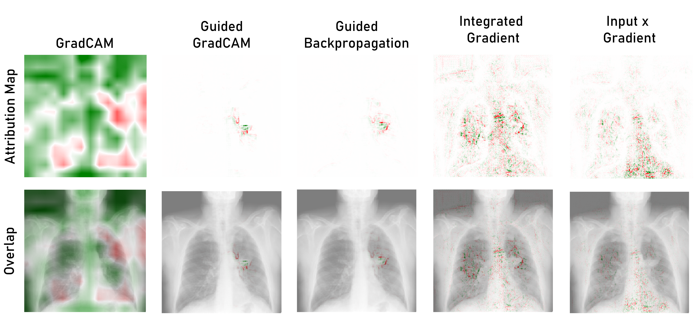
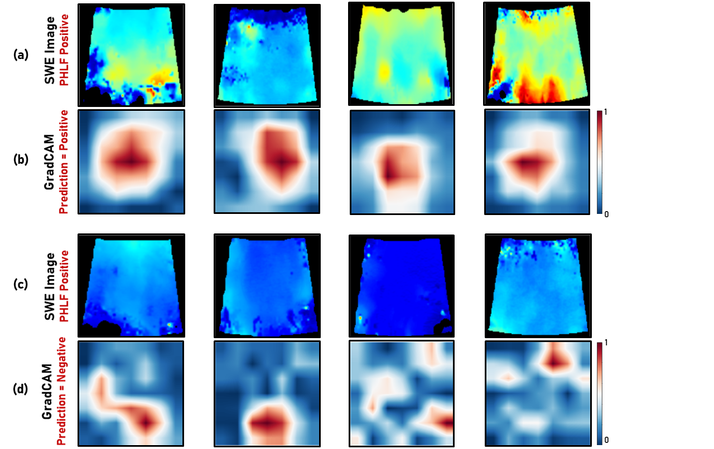

# Heatmap Generation for PyTorch-Based Deep Learning Classifiers in Medical Image Analysis

This repository contains Python scripts for generating heatmaps using PyTorch-based deep learning classifiers. These heatmaps can help visualize and understand the areas of the input images that the models focus on to make their decisions. This is especially useful in medical image analysis for tasks such as disease detection, prediction of post-operative complications, etc.

The repository supports both 2D and 3D images, allowing for the generation of heatmaps for a variety of medical imaging modalities, including but not limited to, 2D X-ray images, 3D CT scan volumes, and 3D MRI volumes.


### Instructions

1. Clone the repository:
    ```
    git clone https://github.com/yourusername/heatmap-generator.git
    ```

2. Navigate into the cloned directory:
    ```
    cd heatmap-generator
    ```

3. Install all required Python packages:
    ```
    pip install -r requirements.txt
    ```

4. Place your model file (.pth) into the root directory.

5. Edit the `config_heatmaps.ini` file with your desired configurations. This file controls the behaviour of the heatmap generator. Please see the Configuration File section for more details.

6. Run the heatmap generation script:
    ```
    python test_heatmaps.py
    ```

### Configuration File

The `config_heatmaps.ini` file contains several parameters that control the heatmap generation:

- `[HeatmapGenerator]`
  - `model_path`: Path to the PyTorch model file.
  - `method_type`: Type of the method to use for the heatmap (e.g., "2D" or "3D").
  - `target_layer`: Name of the target layer in the model.
  - `save_path_folder`: Folder where to save the generated heatmaps.

- `[Attributions]`
  - `method`: Method to use for attributions (e.g., "integrated_gradients").
  - `target_val`: Target value for the attributions.
  - `percentile`: Percentile to use when visualizing the attributions.
  - `alpha`: Alpha value to use when visualizing the attributions.

- `[ImageFiles]`
  - `image_names`: Names of the images to generate heatmaps for, separated by commas.

### Examples

#### Chest X-ray Classification

For this task, you might have a PyTorch model trained to classify diseases from chest x-ray images. Given a set of x-ray images, the model could assist in disease diagnosis. The following is an example of the configuration file:


```
[HeatmapGenerator]
model_path = model.pth
method_type = 2D
target_layer = final_conv_layer
save_path_folder = chest_xray_results

[Attributions]
method = guided_gradcam
target_val = 1
percentile = 98
alpha = 0.5

[ImageFiles]
image_names = patientA.png,patientB.png,patientC.png
```


After editing the configuration file, you would run `python test_heatmaps.py` to generate the heatmaps. The heatmaps will be saved in the specified `save_path_folder`.

#### Post Hepatectomy Liver Failure Prediction




**Note:** This repository is still under development. 
